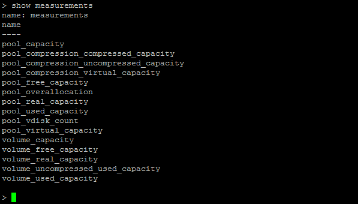
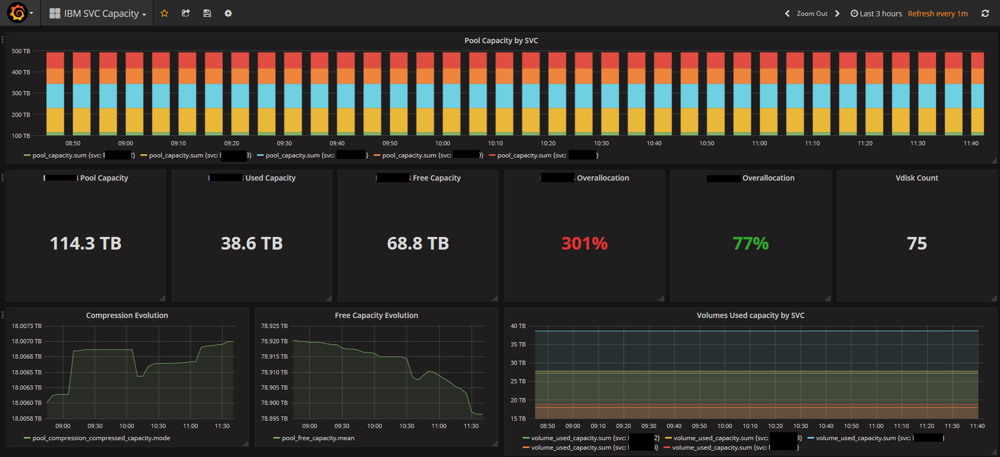

# SVC 2 InfluxDB v2.x
A simple storage metrics collector (written in Python) from IBM SVC equipments whose inject them into a InfluxDB v2.x database.
Works with all IBM kind of hardware running SVC (FlashSystem V9000, V840, ...)

*This is a fork of the project "[svc2influxdb](https://github.com/jbrt/svc2influxdb)" from @jbrt, but it is for InfluxDB v2.x. @jbrt, thanks for your work!*

## Requirements
This script use python 3 and modules like 'paramiko', 'requests' and '[influxdb-client](https://github.com/influxdata/influxdb-client-python)'. You can install them by using this command line:
`$ pip install -r requirements.txt`

## Usage
`$ svc2influxdb2.py your_config.file [--fixed]`

The only required argument is the configuration file.
The --fixed option can be used to force the script to use the same timestamp for the metrics collect from your equipments. It can be helpful to "synchronize" all the metrics collected during a same batch to facilitate the visualization (with Grafana for example).
The capacity values shown in the __measurements are in bytes__ (think to adjust your data type in Grafana if you use it).


## Configuration
The configuration file use a .ini syntax.

#### Declare your InfluxDB database
```ini
[INFLUXDB]
    address = localhost
    organization = youruser
    token = yourpassword
    database = svc2influxdb
```

The INFLUXDB section let you describe the location of your database. The address field is required (can be a name or an IP address and the port).


#### Add IBM SVC informations
```ini
[YOUR_SVC_NAME]
    address = localhost
    username = your_user
    password = your_password

    tag_name1 = value1
    tag_name2 = value2
```

You can add any SVC sections you need. The script will be collect the metrics in a sequential mode.
A SVC section use the name of your SVC equipment (a short name or a nickname why not).
The fields address, username and password are required. It's the same informations you use for a SSH connection.
You can also add __tags__ if you need it. These tags are used to described some informations to enrich your time series. For example you can specify if this SVC is used in a production environment or it's location. 
Example:
```ini
    datacenter = Paris
    room = AB3
```

The key/value pair doesn't matter.
The informations can be used __in your InfluxQL requests__.

## InfluxDB results
The names of the measurements are the same labels shown while you using CLI commands like 'lsvdisk' or 'lsmdiskgrp' (prefixed by 'pool_' or 'volume_' ). Please refer to the IBM online help to get the exact signification of all of them.
List of the measurements:


## Example of data visualization with Grafana


## TODO
Pull requests are welcome ! :smiley:
1. Change the sequential mode to asynchronous mode with the asyncio module
2. Collect not only the storage metrics but also performance metrics

## Miscellaneous
The only commands send to your IBM SVC by this software are :
* lsmdiskgrp
* lsvdisk
* lsvdisk VDISK_ID

## License
This source code is under GNU GPL3 license.
